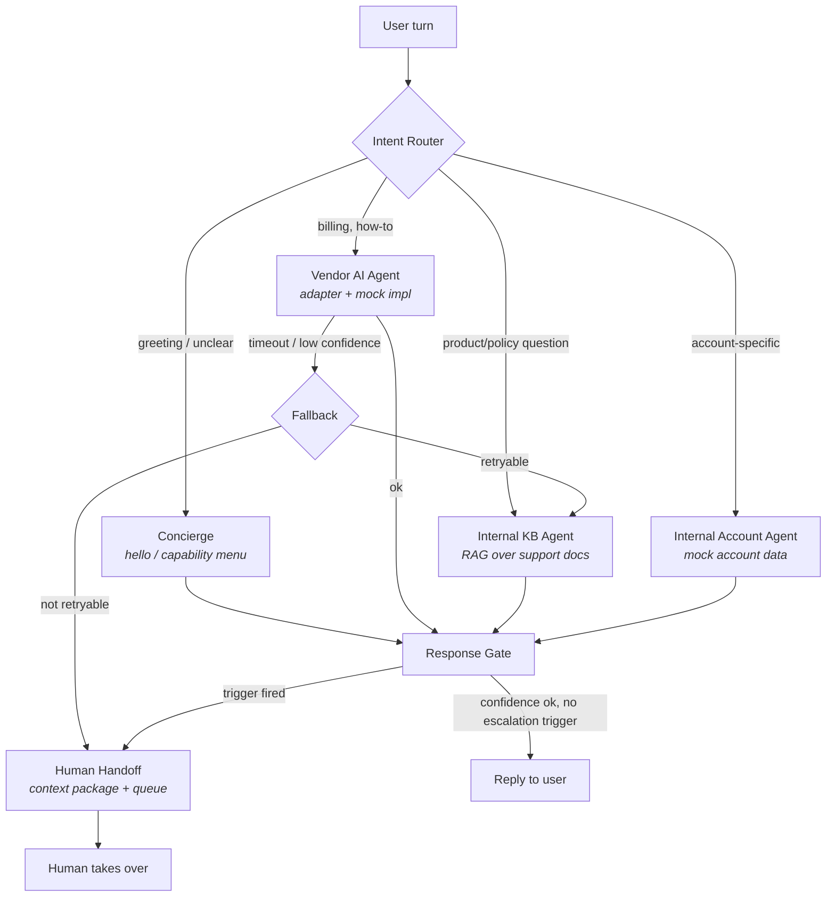

# Ledgerly Support Orchestrator — Technical Design

**Author:** Gabriel B. · **Status:** Draft v1 · **Audience:** Engineering, CX Ops, Product

*Personal demo project. Ledgerly is a fictional payments app; no real company data or systems are involved.*

---

## 1. Problem

Ledgerly's support chat is served by three kinds of responders: a **vendor AI** (third-party support LLM), **internal specialized agents** (knowledge-base retrieval, account lookup), and **human agents**. Today (hypothetically) each is wired ad hoc: context is lost when a conversation moves between them, routing logic is duplicated, and there is no single place to observe or change how a conversation flows.

This doc proposes a **unified orchestration layer**: one Python service that owns conversation state, routes each user turn to the right responder, carries context across transitions, and escalates to humans under explicit conditions — treating the vendor AI as an untrusted dependency that can fail.

**Non-goals (v1):** real vendor integrations (mocked behind an adapter), real-time transport (CLI/scripted driver), authn/authz, persistence beyond in-memory + event log.

## 2. Architecture

Built on **LangGraph**: the conversation is a graph whose nodes are agents and whose edges are routing decisions; a shared typed state object flows through every node.

**Components**

- **Intent Router** — classifies each turn into an intent (billing, how-to, account-specific, complaint, restricted-topic) and dispatches. LLM-based classifier with a rule layer on top: certain intents (fraud claim, legal threat, self-harm) bypass all AI and route straight to human. Rules beat model — deterministic guardrails are cheaper to audit than prompts.
- **Vendor AI Agent** — sits behind a `VendorAdapter` interface (`invoke(state) -> VendorResponse | VendorFailure`). v1 ships one mock implementation with configurable latency, confidence score, and failure injection; the interface is shaped so a Bedrock or Vertex adapter is a drop-in.
- **Internal KB Agent** — RAG over ~15 fictional support docs: embed, retrieve top-k, answer with citations, report retrieval confidence. (Same retrieval pattern as embedding+FAISS product-matching systems, applied to support docs.)
- **Internal Account Agent** — answers account-specific questions from mock account fixtures; demonstrates that internal agents can hold tools/data the vendor must never see.
- **Response Gate** — every candidate reply passes one checkpoint that evaluates escalation triggers before anything reaches the user. Single choke point → single place to audit.
- **Human Handoff** — assembles a structured **context package** (see §5) and moves the conversation to `HUMAN_ACTIVE`; the orchestrator stops generating and only records.

## 3. Conversation state machine

| State | Meaning | Transitions out |
|---|---|---|
| `INTAKE` | New turn received, not yet routed | → `ROUTING` |
| `ROUTING` | Router classifying intent | → `AGENT_ACTIVE`, → `ESCALATING` (restricted intent) |
| `AGENT_ACTIVE` | Vendor or internal agent working | → `GATING` (reply produced), → `FALLBACK` (vendor failure) |
| `FALLBACK` | Vendor failed; trying internal alternative | → `AGENT_ACTIVE` (retry on KB agent), → `ESCALATING` |
| `GATING` | Response gate evaluating triggers | → `RESPONDED`, → `ESCALATING` |
| `RESPONDED` | Reply delivered; awaiting next user turn | → `INTAKE`, → `RESOLVED` |
| `ESCALATING` | Building handoff package | → `HUMAN_ACTIVE` |
| `HUMAN_ACTIVE` | Human agent owns the conversation | → `RESOLVED` |
| `RESOLVED` | Terminal | — |

Every transition is appended to an event log (`conversation_id`, `from_state`, `to_state`, `reason`, `timestamp`) — the trace you replay when someone asks "why did this conversation escalate?"

## 4. Context contract

One typed `ConversationState` (Pydantic) flows through the graph. Key fields: `messages` (full transcript), `current_intent` + history, `active_agent`, `retrieval_context` (KB citations), `confidence_signals` (per-agent scores), `escalation` (trigger, reason, package), `turn_count`, `sentiment_flags`.

Two rules: **(1) agents read the shared state but write only their own namespaced section** — no agent mutates another's output; **(2) the vendor adapter receives a redacted projection** (transcript + intent only, never account data). The contract is versioned; changing it is a design review, not a diff.

## 5. Routing and escalation

**Routing per turn:** rules first (restricted intents → human), then LLM intent classification, then dispatch by intent→agent map. Mid-conversation intent shifts re-route naturally because routing happens every turn against full context.

**Escalation triggers (explicit, ordered):**

1. Restricted intent matched by rule (immediate, pre-AI).
2. Vendor failure after one internal fallback attempt.
3. Agent confidence below threshold twice in a row.
4. User frustration signal (sentiment flag or explicit "let me talk to a person").
5. Turn count exceeds limit without resolution.

**Handoff context package:** conversation summary (auto-generated), full transcript, intents seen, agents attempted with their confidence scores, trigger that fired, and suggested next actions. The human starts warm, not from zero — this is the metric that matters (no repeat-yourself handoffs).

## 6. Observability

Structured JSON logs on every routing decision, agent invocation, gate evaluation, and state transition, keyed by `conversation_id`/`turn_id` — equivalent in content to LangSmith traces, dependency-free for the demo (LangSmith is a config flag away since we're on LangGraph).

## 7. Risks and simplifications

Mock vendor and account data (interfaces are real, implementations are fixtures); in-memory state (production: Redis/Postgres checkpointing via LangGraph checkpointers); single-process (production: horizontally scaled workers, conversation-affine routing); no auth. Each simplification is behind an interface chosen so the production swap is an implementation change, not a redesign.
