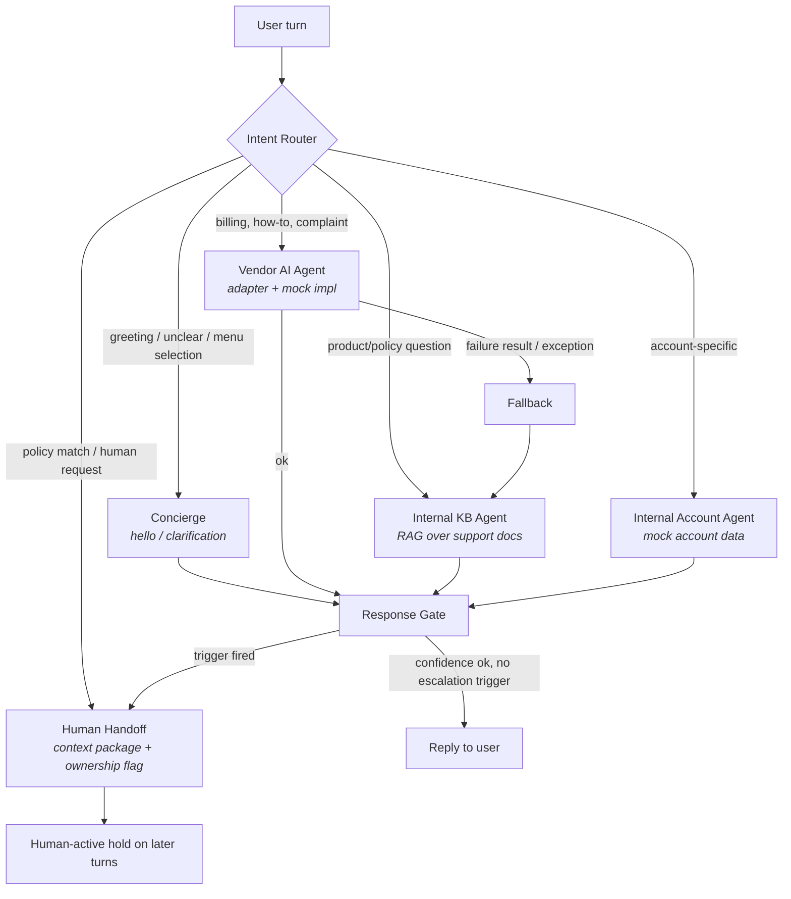

# Ledgerly Support Orchestrator — Technical Design

**Author:** Gabriel B. · **Status:** Implemented demo v1 · **Audience:** Engineering, CX Ops, Product

*Personal demo project. Ledgerly is a fictional payments app; no real company data or systems are involved.*

---

## 1. Problem

Ledgerly's support chat is served by three kinds of responders: a **vendor AI** (third-party support LLM), **internal specialized agents** (knowledge-base retrieval, account lookup), and **human agents**. Today (hypothetically) each is wired ad hoc: context is lost when a conversation moves between them, routing logic is duplicated, and there is no single place to observe or change how a conversation flows.

This doc proposes a **unified orchestration layer**: one Python service that owns conversation state, routes each user turn to the right responder, carries context across transitions, and escalates to humans under explicit conditions — treating the vendor AI as an untrusted dependency that can fail.

**Non-goals (v1):** real vendor integrations (mocked behind an adapter), real-time transport (CLI/scripted driver), authn/authz, persistence beyond in-memory + event log.

## 2. Architecture

Built on **LangGraph**: the conversation is a graph whose nodes are agents and whose edges are routing decisions; a shared typed state object flows through every node.

```mermaid
flowchart TD
    U[User turn] --> R{Intent Router}
    R -->|policy match / human request| H
    R -->|billing, how-to, complaint| V[Vendor AI Agent<br/><i>adapter + mock impl</i>]
    R -->|product/policy question| K[Internal KB Agent<br/><i>RAG over support docs</i>]
    R -->|account-specific| A[Internal Account Agent<br/><i>mock account data</i>]
    R -->|greeting / unclear / menu selection| C[Concierge<br/><i>hello / clarification</i>]
    C --> G
    V -->|ok| G[Response Gate]
    K --> G
    A --> G
    V -->|failure result / exception| F[Fallback]
    F --> K
    G -->|confidence ok, no escalation trigger| OUT[Reply to user]
    G -->|trigger fired| H[Human Handoff<br/><i>context package + ownership flag</i>]
    H --> OUT2[Human-active hold on later turns]
```

**Components**

- **Intent Router** — applies the shared `policy.py` rules before classification. Matched fraud claims and legal threats go directly to handoff without inference; explicit human requests also bypass responders. The classifier sees the latest user message, using deterministic keywords by default or optional OpenAI classification. Menu selections and pending category context are handled separately.
- **Vendor AI Agent** — uses `VendorAdapter.invoke(projection, chaos=None) -> VendorResult`. `VendorResult` contains a draft/confidence or a `VendorFailure`. The mock uses fixed intent templates and confidence values, with timeout and low-confidence injection. The boundary normalizes raised exceptions and incomplete failure results into the KB recovery path. The projection excludes account-agent replies and filters supported PII patterns before reaching the adapter.
- **Internal KB Agent** — retrieves from 15 packaged fictional support articles using TF-IDF or optional dense embeddings. The top article alone is supplied to generation and cited. Offline answers include its complete body. Dense initialization or query failure switches to TF-IDF.
- **Internal Account Agent** — reads packaged fixtures for balances, transactions, and card status. Deposit lookup requires a uniquely matching recorded date or description; otherwise it asks for clarification. Statement requests receive the existing document-location instructions.
- **Response Gate** — every candidate reply passes one checkpoint that evaluates escalation triggers before anything reaches the user. Single choke point → single place to audit.
- **Human Handoff** — assembles a structured **context package** (see §5) and moves the conversation to `HUMAN_ACTIVE`. Later turns update the case transcript and receive a fixed receipt, without classification or generation. Human ownership and delivery are simulated in memory; there is no external queue integration.

## 3. Conversation state machine

| State | Meaning | Transitions out |
|---|---|---|
| `INTAKE` | New turn received, not yet routed | → `ROUTING` |
| `ROUTING` | Router classifying intent | → `AGENT_ACTIVE`, → `ESCALATING` (restricted intent / human request) |
| `AGENT_ACTIVE` | Vendor or internal agent working | → `GATING` (reply produced), → `FALLBACK` (vendor failure) |
| `FALLBACK` | Vendor failed; trying internal alternative | → `AGENT_ACTIVE` (retry on KB agent) |
| `GATING` | Response gate evaluating triggers | → `RESPONDED`, → `ESCALATING` |
| `RESPONDED` | Reply delivered; awaiting next user turn | → `INTAKE` |
| `ESCALATING` | Building handoff package | → `HUMAN_ACTIVE` |
| `HUMAN_ACTIVE` | Human owns the conversation; later turns only update the case and receive a fixed receipt | No state change |
| `RESOLVED` | Reserved enum value; no resolution operation is implemented | — |

Transitions are appended to the conversation's checkpointed `events` list as `TransitionEvent(from_state, to_state, reason, at)`. The containing state supplies the conversation ID. `/trace` prints this history. The intake and fallback markers can include self-transitions; human-hold turns do not add transitions.

## 4. Context contract

`OrchestratorState` is a `TypedDict` with dataclass values for messages, drafts, attempts, transitions, failures, and escalations. `messages`, `events`, `intent_history`, and `agent_attempts` use append-only reducers. Durable fields include turn/frustration/confidence counters, human ownership, escalation, and menu/category context. Intake clears per-turn scratch fields such as `draft`, `vendor_failure`, and `pending_escalation`.

Responders run sequentially, return updates to the shared `draft`, and append durable attempt records containing confidence, citations, or failure kind. Outputs are not stored in separate agent namespaces. The vendor receives a filtered transcript and intent, plus safe redaction metadata, rather than the raw state. Account-agent assistant messages are omitted. Supported email, CPF, card-number, and phone patterns in retained text are replaced; this does not guarantee arbitrary customer text is free of personal information.

## 5. Routing and escalation

**Routing per turn:** policy rules first, then an accepted numeric menu choice, then classification of the latest message. A valid menu choice routes to concierge for a category-specific question and resets the weak-response streak as navigation progress. A pending category helps interpret supported short topic replies; explicit classified intent changes override it. Unclear follow-ups remain low-confidence and can still escalate.

**Pre-responder escalation:** restricted intents and explicit human requests route directly to handoff. Policy-matched restricted turns also skip LLM summarization. Policy matching normalizes case, accents, and common typographic apostrophes; the finite pattern set is visible in `policy.py`.

**Response Gate triggers, in order (first match wins):**

1. Empty or too-short draft (`invalid_response`).
2. Vendor failed and the KB fallback is below the confidence threshold (`vendor_exhausted`).
3. Two consecutive below-threshold replies (`low_confidence`).
4. Two accumulated frustrated user messages (`user_frustration`).
5. More than eight user turns (`turn_limit`).

Low-confidence vendor replies go through the gate and count toward the streak; they do not initiate KB fallback. Thresholds live in `config.py`.

**Handoff context package:** summary, full transcript, intents seen, durable agent attempts (including failures, confidence and citations), trigger, reason, and suggested actions. Restricted handoffs always use a deterministic summary. Other handoffs may use the optional generation backend, with a deterministic fallback. Human-hold turns append subsequent messages to the case without new inference.

## 6. Observability

Structured JSON logs cover routing decisions, responder outcomes, gate decisions, fallback, delivery, and handoff. Calls supplied with graph state carry `conversation_id` and `turn`; backend/index failure records can lack that context. Vendor logs identify omitted account replies and supported PII types without recording the projection text. Newly normalized dependency failures log safe classifications rather than exception text. State transitions live separately in the checkpointed `events` list and are not emitted as individual JSON log records. Optional LangSmith graph tracing is a separate integration.

## 7. Risks and simplifications

Mock vendor and account data (interfaces are real, implementations are fixtures); in-memory state (production: Redis/Postgres checkpointing via LangGraph checkpointers); single-process (production: horizontally scaled workers, conversation-affine routing); no auth. Each simplification is behind an interface chosen so the production swap is an implementation change, not a redesign.
