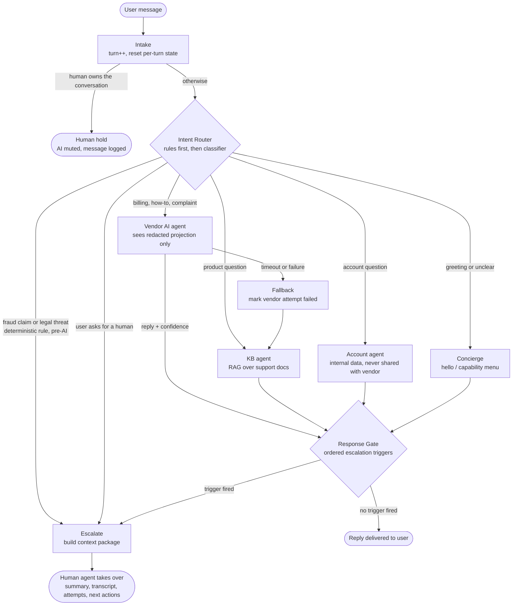
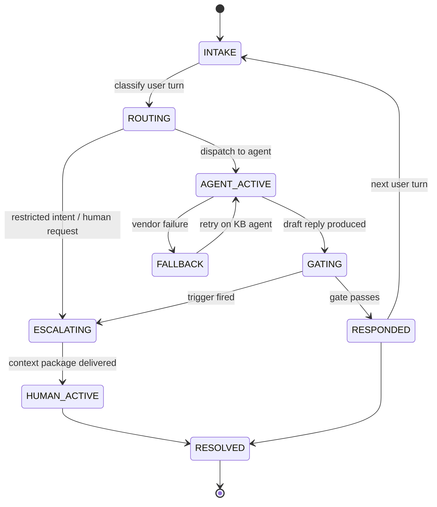

# How a Turn Flows Through the Orchestrator

Every user message triggers one pass through this graph. Conversation
continuity across turns comes from LangGraph checkpointing; escalation
counters (confidence streak, frustration, turn count) persist between turns.

## Turn flow

**Response Gate triggers, evaluated in order (first match wins):**

1. `vendor_exhausted` — vendor failed and the internal fallback is weak too
2. `low_confidence` — two consecutive replies below the confidence threshold
3. `user_frustration` — two frustration signals across the conversation
4. `turn_limit` — conversation exceeded the turn budget unresolved

(Restricted intents and explicit human requests escalate at the router,
before any AI agent runs — they never reach the gate.)

## Conversation state machine

Every transition is appended to the event log with a reason — `/trace` in
the CLI replays it for the current conversation.
