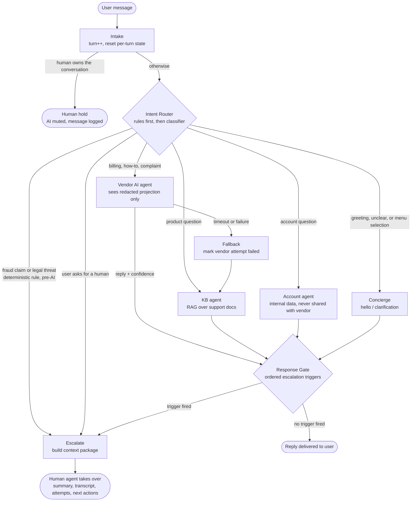
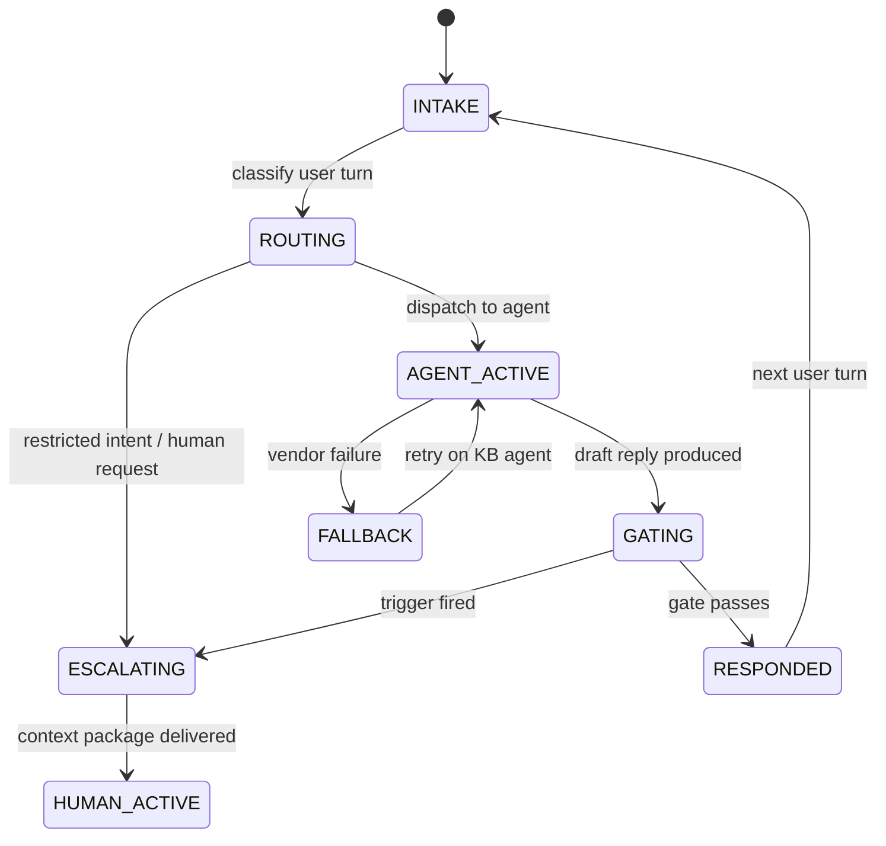

# How a Turn Flows Through the Orchestrator

Every user message triggers one pass through this graph. Conversation
continuity across turns comes from LangGraph checkpointing; escalation
counters (confidence streak, frustration, turn count) persist between turns.

## Turn flow

```mermaid
flowchart TD
    U([User message]) --> IN["Intake<br/>turn++, reset per-turn state"]
    IN -->|human owns the conversation| HH(["Human hold<br/>AI muted, message logged"])
    IN -->|otherwise| R{"Intent Router<br/>rules first, then classifier"}

    R -->|fraud claim or legal threat<br/>deterministic rule, pre-AI| E
    R -->|user asks for a human| E
    R -->|billing, how-to, complaint| V["Vendor AI agent<br/>sees redacted projection only"]
    R -->|product question| K["KB agent<br/>RAG over support docs"]
    R -->|account question| A["Account agent<br/>internal data, never shared with vendor"]
    R -->|greeting, unclear, or menu selection| C["Concierge<br/>hello / clarification"]

    V -->|reply + confidence| G
    V -->|timeout or failure| F["Fallback<br/>mark vendor attempt failed"]
    F --> K
    K --> G{"Response Gate<br/>ordered escalation triggers"}
    A --> G
    C --> G

    G -->|no trigger fired| OUT([Reply delivered to user])
    G -->|trigger fired| E["Escalate<br/>build context package"]
    E --> H(["Human agent takes over<br/>summary, transcript, attempts, next actions"])
```

**Response Gate triggers, evaluated in order (first match wins):**

1. `invalid_response` — the candidate is empty or too short, regardless of self-reported confidence
2. `vendor_exhausted` — vendor failed and the internal fallback is weak too
3. `low_confidence` — two consecutive replies below the confidence threshold
4. `user_frustration` — two frustration signals across the conversation
5. `turn_limit` — conversation exceeded the turn budget unresolved

Restricted intents and explicit human requests bypass responders and the
gate. Restricted handoffs also skip generation during summarization;
other handoffs may use the configured backend to summarize the transcript.

A valid numbered menu choice asks for a concrete question in that category
and resets the weak-response streak. Unclear follow-ups still count as weak;
explicit intent shifts can move the conversation to another category.

## Conversation state machine

```mermaid
stateDiagram-v2
    [*] --> INTAKE
    INTAKE --> ROUTING: classify user turn
    ROUTING --> AGENT_ACTIVE: dispatch to agent
    ROUTING --> ESCALATING: restricted intent / human request
    AGENT_ACTIVE --> GATING: draft reply produced
    AGENT_ACTIVE --> FALLBACK: vendor failure
    FALLBACK --> AGENT_ACTIVE: retry on KB agent
    GATING --> RESPONDED: gate passes
    GATING --> ESCALATING: trigger fired
    RESPONDED --> INTAKE: next user turn
    ESCALATING --> HUMAN_ACTIVE: context package delivered
```

`RESOLVED` is reserved in the enum; no resolution operation is implemented.
Human-active turns update the case and send a fixed receipt without new
transitions or inference. The graph also records intake/fallback self-markers.

Transitions are appended to the checkpointed event history with a reason and
timestamp; `/trace` prints that history. Structured decision logs are separate
and do not contain one record per transition.
